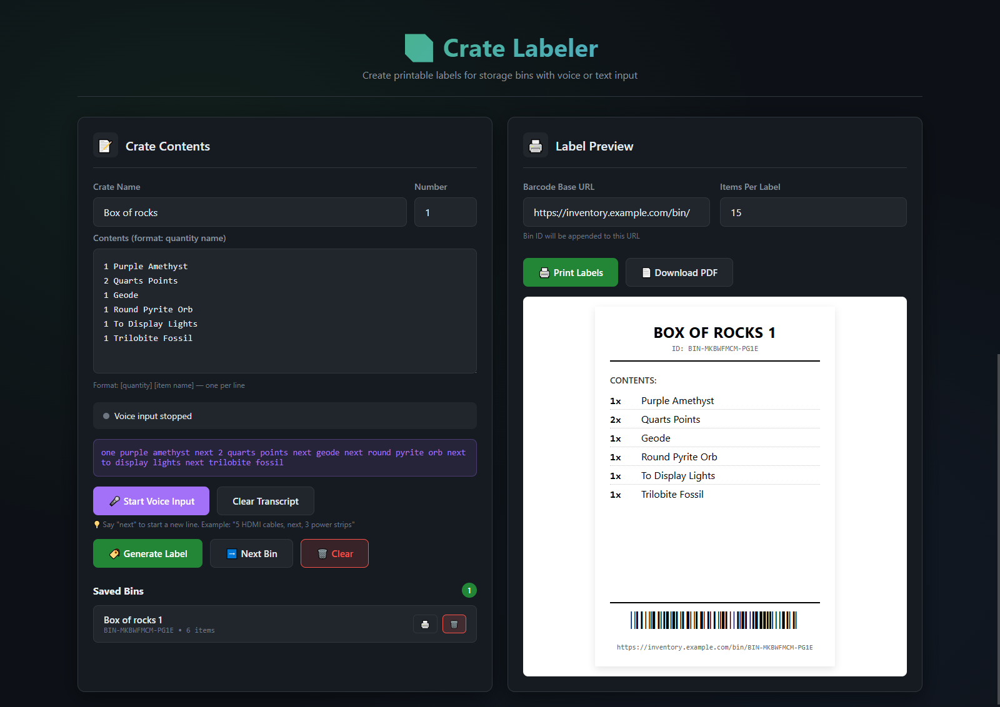

# Crate Inventory Labeler

A simple web app for creating printable labels for storage crates. Everything runs in your browser; no server, no database, no hassle. Just open the HTML file and start labeling.




## Features

- **Voice input** - Talk to your computer and it'll type for you. Say "next" to move to a new line. Works best in Chrome/Edge on non-mobile devices.
- **Text input** - Old school typing. Use `[quantity] [item name]` format if you want.
- **Smart number parsing** - Converts spoken numbers like "five" to digits automatically.
- **Multi-page labels** - Long lists automatically split across multiple pages.
- **QR code generation** - Each crate gets a unique ID with a scannable QR code linking directly to the crate.
- **Share via QR** - Generate a QR code containing all crate data to share with another device. No internet required!
- **Namespace system** - Group your crates (like "Audio Gear 1", "Audio Gear 2") and it'll auto-increment the numbers.
- **PDF export** - Download labels as PDFs ready to print (4" × 6" format).
- **Export/Import** - Export all your crates as JSON or import from a backup file.
- **Hash-based routing** - Share direct links to specific crates using `#BIN-ID` in the URL.
- **Auto-detected base URL** - The QR code URL is automatically detected from your current location.
- **Local storage** - Everything saves in your browser. No accounts, no cloud, no nonsense.
- **Print ready** - Optimized for printing, but honestly it works fine for screen viewing too.
- **Keyboard shortcuts** - Press `Ctrl/Cmd + Enter` to quickly generate labels.

## Getting Started

Just download or clone this repo and open `index.html` in a browser. That's it. No build step, no npm install, no server to run.

```bash
git clone https://github.com/CaelanBorowiec/Crate-Labeler.git
cd Crate-Labeler
# Now just open index.html in your browser
```

**Browser notes:** Voice input only works in Chrome and Edge right now. Everything else works fine in Firefox and Safari too.

## How to Use

### Creating a Label

1. Set your crate name - enter a namespace (like "Audio Gear" or "Power Supplies") and a number. The number auto-increments when you click "Next Crate".

2. Add your items. You can type them in:

   ```
   5 HDMI Cable 6ft
   3 USB-C Adapter
   2 Power Strip
   10 Cable Ties
   ```

   Or use voice input:

   - Click "Start Voice Input"
   - Say something like "5 HDMI cables, next, 3 USB adapters, next, 2 power strips"
   - Say "next" between items to separate them
   - Click "Stop Listening" when you're done

3. Generate and print - Click "Generate Label" to see a preview, then either print directly or download as PDF.

### What the Labels Look Like

```
┌─────────────────────────────────┐
│         AUDIO GEAR 1        ┌──┐│
│     ID: BIN-M4X7K2-A3B9     │QR││
│                             └──┘│
├─────────────────────────────────┤
│ Contents:                       │
│   5x  HDMI Cable 6ft            │
│   3x  USB-C Adapter             │
│   2x  Power Strip               │
│  10x  Cable Ties                │
├─────────────────────────────────┤
│  https://site.com/#BIN-M4X7K2   │
└─────────────────────────────────┘
```

### Sharing a Crate

You can share a crate with someone else in two ways:

1. **Share the URL** - Click on a saved crate to load it, then share your browser URL. The hash (`#BIN-ID`) links directly to that crate.

2. **Share via QR** - Click the "📲 Share Crate" button to generate a QR code containing all crate data. The recipient can scan it on their device to import the crate instantly - no internet required!

### Settings

There are a couple settings you can tweak:

- **Barcode Base URL** - The base URL shown on labels. Automatically detected from your current URL, but you can override it.
- **Items Per Label** - How many items fit on one label before it splits to a new page. Default is 10.

### Viewing Crates via URL

You can view any saved crate directly by adding its ID to the URL hash:

```
https://yoursite.com/crate-labeler/#BIN-M4X7K2-A3B9
```

This is useful for:

- Sharing specific crate labels with others
- Bookmarking frequently accessed crates
- Quick navigation between crates

If you visit a URL for a crate you don't have saved, you'll see a prompt to import a backup file.

## Technical Stuff

### Data Storage

Everything is stored in your browser's `localStorage`:

- `binInventory` - All your saved crates and their contents
- `binInventorySettings` - Your preferences (base URL, items per page, etc.)

### Crate IDs

Each crate gets a unique ID that looks like:

```
BIN-{timestamp_base36}-{random_4char}
Example: BIN-M4X7K2-A3B9
```

### Voice Recognition

Uses the Web Speech API. It's pretty straightforward - continuous recognition, live feedback, and it converts words to numbers ("five" becomes 5). The "next" keyword triggers a line break.

### Print Specs

Labels are sized for 4" × 6" thermal label printers (the standard shipping label size), but they'll print fine on regular paper too.

### Keyboard Shortcuts

- `Ctrl/Cmd + Enter` - Generate label

## Customization

### Changing Label Size

If you want different dimensions, edit the `.label-page` class in `assets/css/styles.css`:

```css
.label-page {
  width: 4in; /* Change this */
  min-height: 6in; /* And this */
}
```

Also update the `@page` rule:

```css
@page {
  size: 4in 6in; /* Match your dimensions */
  margin: 0;
}
```

## Future Ideas

Things I might add eventually (or you could add):

- Different label size presets
- Search through saved crates
- Batch print multiple crates
- Custom label templates

## License

This work is licensed under the [Creative Commons Attribution 4.0 International License](https://creativecommons.org/licenses/by/4.0/).

You are free to:

- **Share** - copy and redistribute the material in any medium or format
- **Adapt** - remix, transform, and build upon the material for any purpose, even commercially

Under the following terms:

- **Attribution** - You must give appropriate credit, provide a link to the license, and indicate if changes were made. You may do so in any reasonable manner, but not in any way that suggests the licensor endorses you or your use.

## Credits

Built using:

- [jsPDF](https://github.com/parallax/jsPDF) for PDF generation
- [html2canvas](https://html2canvas.hertzen.com/) for converting HTML to images
- [QRCode.js](https://github.com/davidshimjs/qrcodejs) for QR code generation
- Web Speech API for voice recognition
